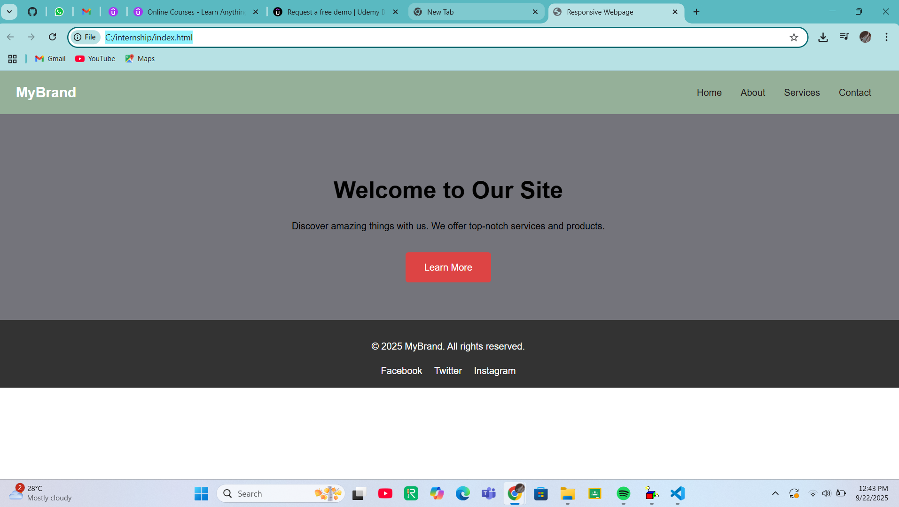

# Responsive Webpage

This project is a basic, responsive landing page created using HTML5 and CSS3. The page is designed to showcase fundamental front-end development skills, including structural layout, styling, and responsiveness.

# Key Technologies Used

* HTML5: Used for the basic structure and semantic content of the webpage.
* CSS3:Used for all styling, including layout with Flexbox and responsive design with Media Queries.

#  Project Structure

The project consists of two main files:

* `index.html`: The main HTML file containing the page's content, including a header, a hero section, and a footer.
* `style.css`: The stylesheet for the project, which handles the page's visual design and responsiveness.

# Features

* Responsive Layout: The page adapts to different screen sizes, with the navigation links collapsing on smaller devices for a better user experience.
* Flexbox: The header and navigation are laid out using CSS Flexbox for efficient and flexible alignment.
* Clear Call to Action: A prominent button in the hero section encourages user interaction.
* Semantic HTML:Uses modern HTML5 tags like `<header>`, `<nav>`, `<section>`, and `<footer>` for better accessibility and search engine optimization.

# How to Run

To view the project, simply open the `index.html` file in your web browser. For development, using a Live Server extension in a code editor like VS Code is recommended to see real-time changes.

# Screenshots

